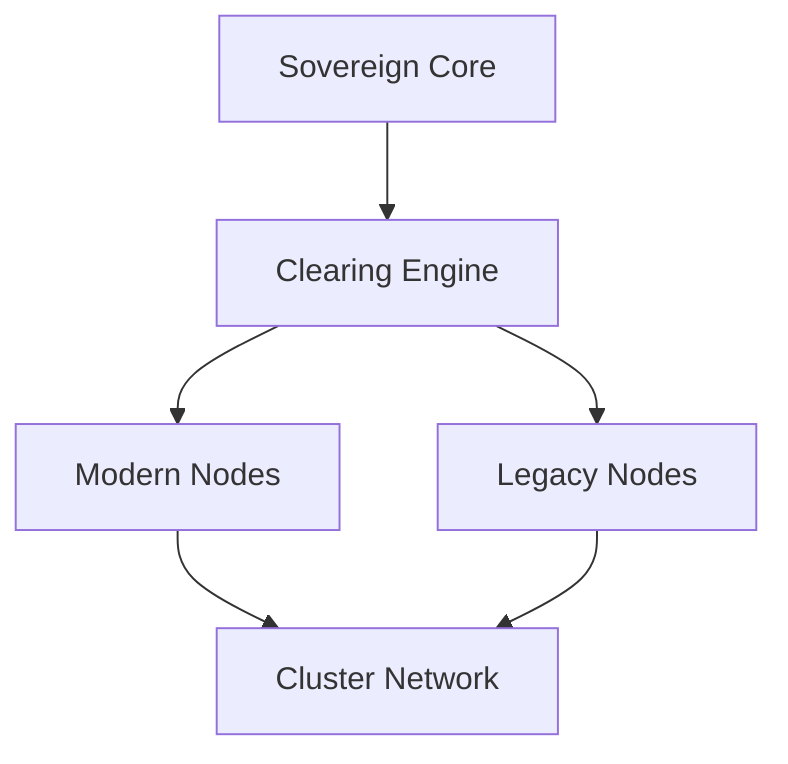

# Legacy System Integration Layer

## Overview
This document defines how historical and legacy computing systems are integrated into the RitualMesh architecture.

## Definition
Legacy integration enables restored computing systems to participate as active nodes within a distributed architecture rather than remaining passive artifacts.

## Supported Legacy Systems
Examples include:
- Apple I
- PDP-11
- Honeywell DPS-6
- IBM RS/6000

## Architecture Role

## Functional Capabilities
- remote accessibility
- participation in validation workflows
- historical system interaction
- modular service interface compatibility

## Integration Method
Legacy systems connect through adapter layers that translate:
- communication protocols
- data formats
- execution constraints

## Patent Alignment
This layer supports claims related to:
- heterogeneous computing environments
- distributed node participation
- modular service architecture

## Strategic Value
- preserves historical computing relevance
- extends system reach across generations of hardware
- enables unique distributed architectures combining past and present systems
