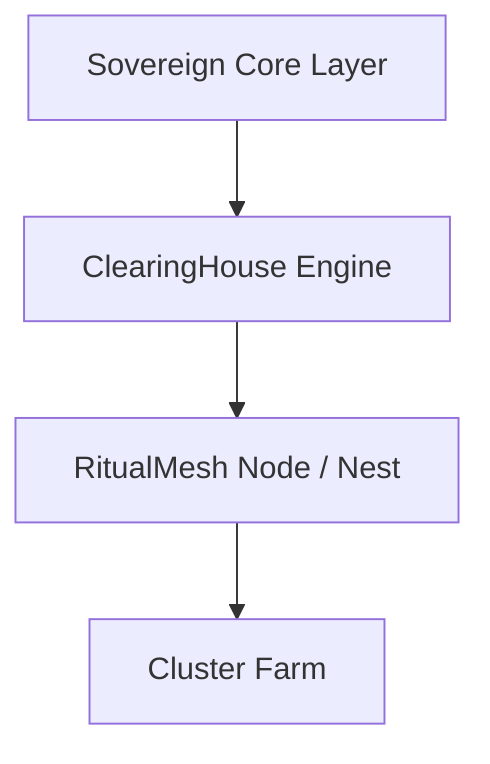

# Sovereign Core Architecture (Enterprise Alignment)

## Overview
This document defines the Sovereign Core layer within RitualMesh, aligned with enterprise-grade architecture principles inspired by IBM Sovereign Core.

## Definition
The Sovereign Core layer is a control and governance boundary that ensures:
- identity integrity
- transaction authority
- auditability
- operational control

## Architecture Stack

## Core Components

### 1. Control Plane
- Federated node authority
- Configuration ownership
- Operational control

### 2. Identity & Key Management
- Wallet ownership
- Access validation
- Cryptographic authority

### 3. Transaction Governance
- Validation before execution
- Settlement logic enforcement
- Ownership state tracking

### 4. Audit & Compliance
- Logging of all operations
- Verifiable transaction history
- Continuous audit readiness

### 5. Boundary Enforcement
- Node-level sovereignty
- Isolation of execution environments
- Controlled interaction between services

## Design Principles

### Sovereignty by Architecture
Control is embedded into the system design, not dependent on external providers.

### Modular Execution
Each service operates independently and communicates through defined interfaces.

### Fractal Replication
Each node represents a repeatable architecture unit that can scale horizontally.

### Canonical Authority
The primary node maintains authoritative state, with secondary nodes verifying integrity.

## Enterprise Positioning
This architecture aligns with modern enterprise requirements for:
- data sovereignty
- compliance enforcement
- auditability
- operational independence

## Conclusion
The Sovereign Core layer transforms RitualMesh from a decentralized system into an enterprise-aligned architecture capable of supporting regulated environments and future expansion.
